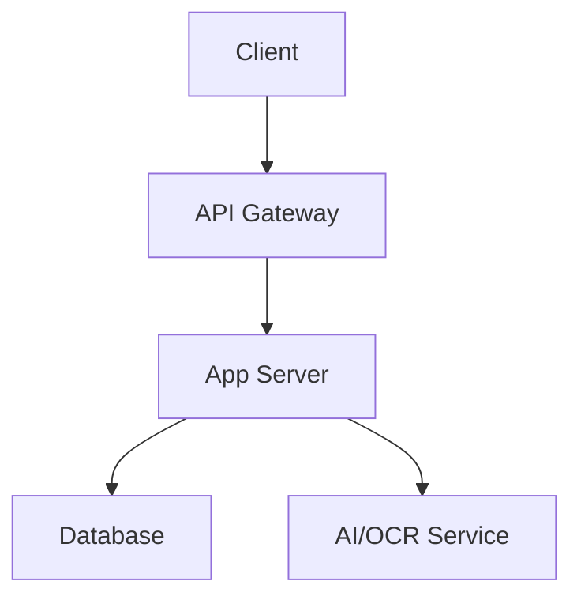

# システムアーキテクチャ要件

## 📋 概要

このディレクトリは、AI-orchestrationシステムの技術アーキテクチャを定義します。フロントエンド、バックエンド、AI/OCRサービス、インフラストラクチャの各層の設計方針と構成要素を明確化します。

### アーキテクチャ構成
- **フロントエンド層** - React + Fabric.js/Konva.js でのキャンバス実装
- **バックエンド層** - Node.js/Python での API サーバー
- **AI/OCR層** - Claude API + Tesseract/Azure OCR
- **データ層** - PostgreSQL + Redis + S3/Cloud Storage
- **インフラ層** - クラウドベース（AWS/GCP/Azure）

## 🎯 検討すべきこと

### 1. フロントエンド設計
- [ ] **フレームワーク選択**
  - React (推奨) or Vue.js
  - TypeScript採用
  - 状態管理: Zustand or Redux Toolkit
  - UIライブラリ: Material-UI or Ant Design

- [ ] **キャンバスライブラリ**
  - Fabric.js (Canvas API) or Konva.js (Canvas/WebGL)
  - パフォーマンス検証（1000+オブジェクト）
  - エクスポート機能（PDF, PNG）
  - イベント処理の効率性

- [ ] **通信設計**
  - REST API or GraphQL
  - WebSocket (リアルタイム同期)
  - ファイルアップロード（multipart/form-data）
  - エラーハンドリング、リトライロジック

### 2. バックエンド設計
- [ ] **API サーバー**
  - Node.js (Express/Fastify) or Python (FastAPI)
  - 認証・認可: JWT or OAuth 2.0
  - レート制限: Redis ベース
  - ロギング: Winston/Bunyan

- [ ] **AI/OCR処理サーバー**
  - Python (FastAPI) 推奨
  - 非同期処理: Celery + Redis
  - バッチ処理キュー
  - タイムアウト管理

- [ ] **データ永続化**
  - PostgreSQL: メタデータ、ユーザー情報
  - Redis: キャッシュ、セッション、キュー
  - S3/GCS: 元ファイル、生成ファイル保存

### 3. AI/OCR 構成
- [ ] **Claude API 統合**
  - API キー管理（環境変数）
  - プロンプト設計（テキスト/表/図形抽出）
  - レスポンスパース処理
  - エラーハンドリング、フォールバック

- [ ] **OCR エンジン**
  - Tesseract (オープンソース) or Azure OCR (商用)
  - 言語パック（日本語、英語）
  - 前処理（画像補正、ノイズ除去）
  - 精度向上策

- [ ] **ハイブリッド戦略**
  - Claude API: 複雑なレイアウト、表構造
  - Tesseract: 単純なテキスト抽出
  - コスト最適化ロジック

### 4. インフラストラクチャ
- [ ] **クラウドプロバイダー**
  - AWS (推奨) or GCP or Azure
  - リージョン選択（レイテンシ考慮）
  - コスト見積もり

- [ ] **コンピューティング**
  - コンテナ: Docker + Kubernetes or ECS
  - サーバーレス: Lambda/Cloud Functions (軽量処理)
  - オートスケーリング設定

- [ ] **ストレージ**
  - オブジェクトストレージ: S3/GCS
  - データベース: RDS/Cloud SQL
  - CDN: CloudFront/Cloud CDN

- [ ] **監視・ログ**
  - APM: New Relic or Datadog
  - ログ集約: CloudWatch/Stackdriver
  - アラート設定

### 5. セキュリティ設計
- [ ] **認証・認可**
  - JWT トークンベース認証
  - RBAC (Role-Based Access Control)
  - セッション管理

- [ ] **通信セキュリティ**
  - HTTPS 必須
  - CORS 設定
  - CSP (Content Security Policy)

- [ ] **データ保護**
  - ファイル暗号化（保存時）
  - 通信暗号化（TLS 1.3）
  - PII データの匿名化

## ✅ 完了の基準

各アーキテクチャ層が以下の状態に達していること：

1. **技術選定完了** - 使用技術とバージョンが確定
2. **構成図作成** - システム構成図、シーケンス図が完成
3. **性能要件定義** - レスポンスタイム、スループット目標設定
4. **拡張性確保** - 将来的な機能追加、負荷増加に対応可能
5. **セキュリティ評価** - 脅威モデリング、対策の実装

## 📝 テンプレート：アーキテクチャ設計書

```markdown
## [層名] アーキテクチャ設計

### 技術スタック
| カテゴリ | 技術 | バージョン | 選定理由 |
|---------|------|-----------|---------|
| [カテゴリ1] | [技術名] | [ver] | [理由] |
| [カテゴリ2] | [技術名] | [ver] | [理由] |

### 構成図


### データフロー
1. **入力**: [データソース]
2. **処理**: [変換・加工]
3. **出力**: [結果格納]

### API 設計
**エンドポイント**: `[METHOD] /api/v1/[path]`

**リクエスト**
```json
{
  "param1": "value"
}
```

**レスポンス**
```json
{
  "status": "success",
  "data": { ... }
}
```

### パフォーマンス要件
- **レスポンスタイム**: [目標値]ms
- **スループット**: [リクエスト数]/秒
- **同時接続数**: [最大数]
- **リソース使用率**: CPU [%], Memory [GB]

### スケーラビリティ
- **水平スケール**: [戦略]
- **垂直スケール**: [戦略]
- **ボトルネック対策**: [対策]

### セキュリティ対策
| 脅威 | 対策 | 実装方法 |
|-----|------|---------|
| [脅威1] | [対策] | [実装] |

### 監視・運用
- **ヘルスチェック**: [エンドポイント]
- **ログレベル**: [INFO/WARN/ERROR]
- **アラート条件**: [閾値]

### コスト見積もり
| リソース | 月額コスト | 備考 |
|---------|-----------|------|
| [リソース1] | $[金額] | [備考] |
```

## 🔗 関連ドキュメント

### 上位ドキュメント
- [../README.md](../README.md) - 技術要件全体の概要
- [../../01_vision/](../../01_vision/) - プロダクトビジョン

### 詳細設計
- [../tech_stack/](../tech_stack/) - 技術スタック詳細
- [../api_design/](../api_design/) - API 設計仕様
- [../infrastructure/](../infrastructure/) - インフラ構成詳細

### 非機能要件
- [../../06_non_functional/](../../06_non_functional/) - 性能、セキュリティ要件

### 開発計画
- [../../09_development/](../../09_development/) - 開発フェーズ、テスト計画

## 📌 重要な注意事項

### MVP対応優先順位
1. **Phase 1 (MVP)**:
   - フロントエンド: React + Fabric.js
   - バックエンド: Node.js (Express)
   - AI/OCR: Claude API + Tesseract
   - インフラ: AWS EC2 + S3 + RDS

2. **Phase 2 (スケール)**:
   - Kubernetes導入
   - Redis キャッシュ層追加
   - WebSocket リアルタイム同期
   - CDN 導入

3. **Phase 3 (最適化)**:
   - マイクロサービス化
   - サーバーレス移行（部分的）
   - AI/OCR 精度向上
   - グローバル展開対応

### 技術選定の基準
1. **実績**: プロダクション環境での採用実績
2. **コミュニティ**: アクティブな開発、豊富なドキュメント
3. **パフォーマンス**: ベンチマーク結果
4. **コスト**: ライセンス、運用コストの妥当性
5. **学習曲線**: チームのスキルセット適合性

### パフォーマンス目標値（MVP）
- **ページ読み込み**: 2秒以内（3G回線）
- **ファイルアップロード**: 10MB で 3秒以内
- **AI/OCR処理**: 1ページ 5秒以内
- **キャンバス描画**: 60fps（100オブジェクト）
- **API応答**: 200ms以内（95パーセンタイル）

### セキュリティ基準
- **OWASP Top 10 対応**: 全項目の対策実施
- **データ暗号化**: 保存時・通信時ともに必須
- **アクセス制御**: 最小権限の原則
- **監査ログ**: 重要操作の記録
- **脆弱性スキャン**: 定期的な自動スキャン

### コスト最適化戦略
1. **初期フェーズ**: シンプルな構成で低コスト
2. **スケール時**: オートスケーリングで効率化
3. **AI/OCR**: 使用量に応じたエンジン選択
4. **ストレージ**: ライフサイクルポリシーで古いデータをアーカイブ

### 技術的負債の管理
- **定期的なリファクタリング**: スプリントごとに20%の時間確保
- **バージョンアップ**: 依存ライブラリの定期更新
- **ドキュメント**: アーキテクチャ変更時の更新義務
- **テストカバレッジ**: 80%以上を維持
