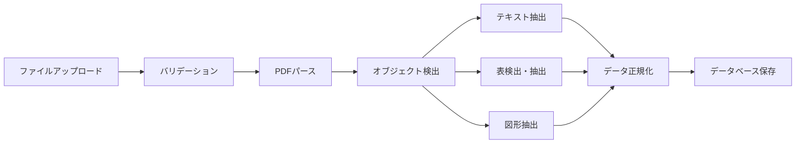
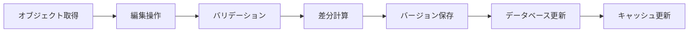
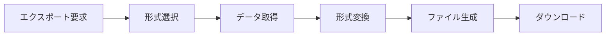

# データ要件テンプレート

> このテンプレートを使用して、各データ要件ドキュメントを作成してください。

## 基本情報

- **カテゴリ**: [data_model / data_flow / storage / privacy]
- **作成日**: YYYY-MM-DD
- **最終更新**: YYYY-MM-DD
- **ステータス**: [Draft / Review / Approved / Revised]
- **関連ドキュメント**: [リンク]

---

## 1. データモデル要件

### 1.1 オブジェクト構造

#### テキストオブジェクト
```typescript
interface TextObject {
  id: string;                    // 一意識別子
  type: 'text';                  // オブジェクトタイプ
  content: string;               // テキストコンテンツ
  position: {                    // 位置情報
    page: number;
    x: number;
    y: number;
    width: number;
    height: number;
  };
  style: {                       // スタイル情報
    fontFamily: string;
    fontSize: number;
    fontWeight: string;
    color: string;
    alignment: 'left' | 'center' | 'right' | 'justify';
  };
  metadata: ObjectMetadata;      // メタデータ
  createdAt: Date;
  updatedAt: Date;
}
```

#### 表オブジェクト
```typescript
interface TableObject {
  id: string;
  type: 'table';
  rows: number;                  // 行数
  columns: number;               // 列数
  cells: TableCell[][];          // セルデータ
  position: Position;
  style: TableStyle;
  metadata: ObjectMetadata;
  createdAt: Date;
  updatedAt: Date;
}

interface TableCell {
  content: string;
  rowSpan: number;
  colSpan: number;
  style: CellStyle;
}
```

#### 図形オブジェクト
```typescript
interface ShapeObject {
  id: string;
  type: 'shape';
  shapeType: 'rectangle' | 'circle' | 'line' | 'polygon' | 'custom';
  vectorData: VectorData;        // ベクターデータ
  position: Position;
  style: ShapeStyle;
  metadata: ObjectMetadata;
  createdAt: Date;
  updatedAt: Date;
}

interface VectorData {
  paths: Path[];
  fill?: string;
  stroke?: string;
  strokeWidth?: number;
}
```

### 1.2 プロジェクト構造

```typescript
interface Project {
  id: string;
  name: string;
  description?: string;
  documents: Document[];         // プロジェクト内のドキュメント
  settings: ProjectSettings;
  createdBy: string;
  createdAt: Date;
  updatedAt: Date;
}

interface Document {
  id: string;
  projectId: string;
  filename: string;
  originalFile: File;            // 元のPDFファイル
  pages: Page[];                 // ページ構造
  objects: (TextObject | TableObject | ShapeObject)[];
  metadata: DocumentMetadata;
  version: number;               // バージョン番号
  createdAt: Date;
  updatedAt: Date;
}

interface Page {
  number: number;
  width: number;
  height: number;
  objects: string[];             // オブジェクトIDの配列
  thumbnail?: string;            // サムネイル画像URL
}
```

### 1.3 メタデータ

```typescript
interface ObjectMetadata {
  extractedBy: 'auto' | 'manual'; // 抽出方法
  confidence?: number;            // AI抽出の信頼度 (0-1)
  source: {
    page: number;
    bbox: BoundingBox;
  };
  tags?: string[];                // ユーザータグ
  annotations?: Annotation[];     // 注釈
  customProperties?: Record<string, any>; // カスタムプロパティ
}

interface DocumentMetadata {
  title?: string;
  author?: string;
  subject?: string;
  keywords?: string[];
  pageCount: number;
  fileSize: number;
  pdfVersion?: string;
  createdDate?: Date;
  modifiedDate?: Date;
}
```

---

## 2. データフロー要件

### 2.1 アップロード → 抽出フロー



**各ステージの処理内容:**

1. **ファイルアップロード**
   - 入力: PDFファイル
   - 出力: 一時ストレージURL
   - バリデーション: ファイルサイズ、形式チェック

2. **PDFパース**
   - 入力: PDFファイルパス
   - 出力: ページ構造、メタデータ
   - 処理: PDF.jsまたはPyPDF2使用

3. **オブジェクト検出**
   - 入力: ページ画像/テキストレイヤー
   - 出力: オブジェクト候補リスト
   - 処理: AIモデルによる検出

4. **データ正規化**
   - 入力: 生の抽出データ
   - 出力: 標準化されたオブジェクト
   - 処理: データモデルへのマッピング

### 2.2 編集・変換フロー



**編集操作の種類:**

- テキスト編集: 内容、スタイル変更
- 表編集: セル結合、行列追加/削除
- 図形編集: パス変更、スタイル変更
- 配置変更: 位置、サイズ、回転

### 2.3 エクスポートフロー



**対応形式:**

- PDF: 元のレイアウト保持
- Word: .docx形式
- PowerPoint: .pptx形式
- JSON: 構造化データ
- Markdown: テキストベース

---

## 3. ストレージ設計要件

### 3.1 ローカルストレージ vs クラウドストレージ

#### ローカルストレージ (IndexedDB)

**用途:**
- 作業中のドラフトデータ
- オフライン編集サポート
- 高速アクセスが必要なデータ

**データタイプ:**
```typescript
// IndexedDBスキーマ
interface LocalStorage {
  projects: Project[];           // プロジェクト一覧
  documents: Document[];         // ドキュメント詳細
  objects: Object[];             // オブジェクトキャッシュ
  drafts: Draft[];               // 未保存の編集
  settings: UserSettings;        // ユーザー設定
}
```

#### クラウドストレージ (Supabase/Firebase)

**用途:**
- 永続化データ
- マルチデバイス同期
- バックアップとリカバリ

**データ構造:**
```sql
-- PostgreSQL スキーマ
CREATE TABLE projects (
  id UUID PRIMARY KEY,
  user_id UUID REFERENCES users(id),
  name VARCHAR(255),
  settings JSONB,
  created_at TIMESTAMP,
  updated_at TIMESTAMP
);

CREATE TABLE documents (
  id UUID PRIMARY KEY,
  project_id UUID REFERENCES projects(id),
  filename VARCHAR(255),
  file_url TEXT,
  metadata JSONB,
  version INTEGER,
  created_at TIMESTAMP,
  updated_at TIMESTAMP
);

CREATE TABLE objects (
  id UUID PRIMARY KEY,
  document_id UUID REFERENCES documents(id),
  type VARCHAR(50),
  data JSONB,
  position JSONB,
  style JSONB,
  metadata JSONB,
  created_at TIMESTAMP,
  updated_at TIMESTAMP
);
```

### 3.2 バージョン管理

```typescript
interface Version {
  id: string;
  documentId: string;
  versionNumber: number;
  snapshot: DocumentSnapshot;    // 完全なスナップショット
  changes: Change[];             // 差分情報
  createdBy: string;
  createdAt: Date;
  description?: string;
}

interface Change {
  type: 'create' | 'update' | 'delete';
  objectId: string;
  before?: any;
  after?: any;
}
```

**バージョン管理戦略:**
- 自動保存: 30秒ごと
- マニュアル保存: ユーザー操作時
- スナップショット: 10バージョンごと
- 履歴保持: 30日間または50バージョン

### 3.3 パフォーマンス最適化

#### キャッシング戦略

```typescript
// メモリキャッシュ (LRU)
class ObjectCache {
  private cache: Map<string, CachedObject>;
  private maxSize: number = 1000;

  get(id: string): Object | null;
  set(id: string, object: Object): void;
  invalidate(id: string): void;
  clear(): void;
}

// CDNキャッシュ (画像・ファイル)
interface CDNConfig {
  provider: 'cloudflare' | 'aws-cloudfront';
  ttl: number;                   // Time to live (秒)
  regions: string[];             // 配信リージョン
}
```

#### インデックス戦略

```sql
-- パフォーマンス最適化用インデックス
CREATE INDEX idx_objects_document ON objects(document_id);
CREATE INDEX idx_objects_type ON objects(type);
CREATE INDEX idx_objects_created ON objects(created_at DESC);
CREATE INDEX idx_documents_project ON documents(project_id);

-- 全文検索用インデックス
CREATE INDEX idx_objects_content ON objects
  USING GIN(to_tsvector('english', data->>'content'));
```

---

## 4. プライバシー・セキュリティ要件

### 4.1 個人情報保護方針

#### 収集するデータ

```typescript
interface PersonalData {
  // 必須収集データ
  userId: string;                // 匿名化されたユーザーID
  email: string;                 // 認証用

  // 任意収集データ（同意必須）
  name?: string;
  profileImage?: string;

  // 自動収集データ（通知必須）
  usage: {
    lastLogin: Date;
    documentCount: number;
    storageUsed: number;
  };

  // 収集しないデータ
  // - ドキュメントの実際のコンテンツ（ユーザーデータ）
  // - 位置情報
  // - デバイス識別子
}
```

#### データ保持期間

- アクティブユーザー: 無期限
- 非アクティブユーザー: 最終ログインから1年後に通知、2年後に削除
- 削除リクエスト: 30日以内に完全削除
- バックアップ: 削除から90日後にバックアップからも削除

### 4.2 GDPR/CCPA対応

#### ユーザー権利の実装

```typescript
interface UserRights {
  // アクセス権 (Right to Access)
  exportData(): Promise<UserDataExport>;

  // 訂正権 (Right to Rectification)
  updatePersonalInfo(data: Partial<PersonalData>): Promise<void>;

  // 削除権 (Right to Erasure)
  deleteAccount(): Promise<void>;

  // データポータビリティ権 (Right to Data Portability)
  downloadData(format: 'json' | 'csv'): Promise<Blob>;

  // 処理制限権 (Right to Restriction)
  restrictProcessing(restrictions: string[]): Promise<void>;

  // 異議権 (Right to Object)
  optOut(purposes: string[]): Promise<void>;
}
```

#### 同意管理

```typescript
interface ConsentManagement {
  consents: {
    essential: boolean;          // 必須（サービス提供に必要）
    analytics: boolean;          // 分析・改善目的
    marketing: boolean;          // マーケティング目的
    thirdParty: boolean;         // サードパーティ連携
  };
  consentDate: Date;
  consentVersion: string;        // 同意バージョン
  ipAddress?: string;            // 同意時のIPアドレス
}
```

### 4.3 データ暗号化要件

#### 保存時の暗号化 (Encryption at Rest)

```typescript
interface EncryptionAtRest {
  // データベース暗号化
  database: {
    algorithm: 'AES-256-GCM';
    keyManagement: 'AWS-KMS' | 'Azure-Key-Vault';
    keyRotation: '90days';
  };

  // ファイル暗号化
  files: {
    algorithm: 'AES-256-CBC';
    encryption: 'server-side';   // サーバーサイド暗号化
    keyPerFile: true;            // ファイルごとに異なるキー
  };

  // バックアップ暗号化
  backups: {
    algorithm: 'AES-256-GCM';
    encrypted: true;
    keyEscrow: true;             // キーエスクロー
  };
}
```

#### 転送時の暗号化 (Encryption in Transit)

```typescript
interface EncryptionInTransit {
  // HTTPS/TLS設定
  tls: {
    version: 'TLS 1.3';
    cipherSuites: [
      'TLS_AES_256_GCM_SHA384',
      'TLS_CHACHA20_POLY1305_SHA256'
    ];
    certificateType: 'EV-SSL';   // Extended Validation
    hsts: true;                  // HTTP Strict Transport Security
  };

  // WebSocket暗号化
  websocket: {
    protocol: 'wss://';
    tlsVersion: 'TLS 1.3';
  };
}
```

### 4.4 アクセス制御

#### ロールベースアクセス制御 (RBAC)

```typescript
enum Role {
  OWNER = 'owner',               // 完全な権限
  EDITOR = 'editor',             // 編集権限
  VIEWER = 'viewer',             // 閲覧のみ
  COMMENTER = 'commenter'        // コメントのみ
}

interface Permission {
  project: {
    read: boolean;
    write: boolean;
    delete: boolean;
    share: boolean;
  };
  document: {
    read: boolean;
    write: boolean;
    delete: boolean;
    export: boolean;
  };
  object: {
    read: boolean;
    write: boolean;
    delete: boolean;
  };
}

const rolePermissions: Record<Role, Permission> = {
  [Role.OWNER]: { /* 全て true */ },
  [Role.EDITOR]: { /* 削除以外 true */ },
  [Role.VIEWER]: { /* read のみ true */ },
  [Role.COMMENTER]: { /* read と一部の write */ }
};
```

#### アクセスログ

```typescript
interface AccessLog {
  id: string;
  userId: string;
  action: 'read' | 'write' | 'delete' | 'share' | 'export';
  resourceType: 'project' | 'document' | 'object';
  resourceId: string;
  ipAddress: string;
  userAgent: string;
  timestamp: Date;
  success: boolean;
  errorMessage?: string;
}

// ログ保持期間: 1年間
// 監査用途: コンプライアンス、セキュリティ調査
```

### 4.5 データ削除・匿名化ポリシー

#### 論理削除 vs 物理削除

```typescript
interface DeletionPolicy {
  // 論理削除（ソフトデリート）
  softDelete: {
    targets: ['documents', 'objects'];
    retention: '30days';         // 復元可能期間
    marker: 'deleted_at';        // 削除マーカー
  };

  // 物理削除（ハードデリート）
  hardDelete: {
    triggers: [
      'retention_period_expired',
      'user_deletion_request',
      'gdpr_compliance'
    ];
    cascade: true;               // 関連データも削除
    backup_removal: '90days';    // バックアップからの削除
  };
}
```

#### 匿名化処理

```typescript
interface AnonymizationStrategy {
  // 個人識別情報の削除
  pii_removal: {
    fields: ['email', 'name', 'ipAddress'];
    method: 'hash_with_salt';
  };

  // データ集約による匿名化
  aggregation: {
    level: 'project';            // プロジェクト単位で集約
    metrics: ['document_count', 'storage_used'];
  };

  // K-匿名性の保証
  k_anonymity: {
    k: 5;                        // 最低5人の同一属性グループ
    quasi_identifiers: ['age_range', 'region'];
  };
}
```

---

## 検証項目

- [ ] データモデルは全オブジェクトタイプをカバーしているか
- [ ] データフローは各処理ステージで適切なエラーハンドリングを含むか
- [ ] ストレージ設計はパフォーマンス要件を満たすか
- [ ] バージョン管理は複数ユーザーの同時編集に対応しているか
- [ ] プライバシー要件はGDPR/CCPAに準拠しているか
- [ ] 暗号化は業界標準（AES-256など）に従っているか
- [ ] アクセス制御は最小権限の原則に従っているか
- [ ] データ削除ポリシーは法的要件を満たすか

---

## 関連ドキュメント

- [アーキテクチャ設計](../05_technical/architecture/)
- [API仕様](../05_technical/api/)
- [セキュリティ要件](../05_technical/security/)
- [パフォーマンス要件](../06_non_functional/performance/)

---

## 変更履歴

| 日付 | 変更内容 | 担当者 |
|------|---------|--------|
| YYYY-MM-DD | 初版作成 | - |
