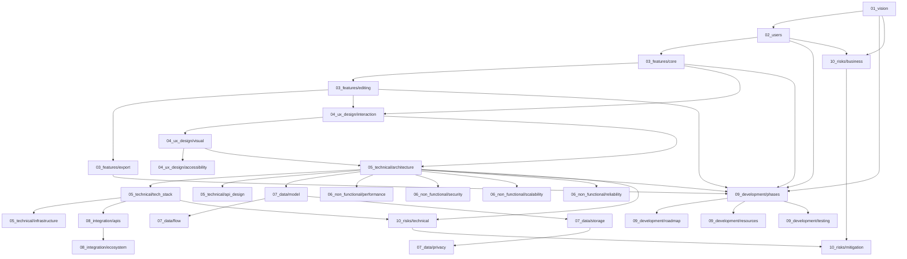

# 🕸️ カテゴリ間依存関係マップ

このドキュメントは、要件定義の各カテゴリ間の依存関係を可視化し、検討順序の論理的根拠を示します。

## 📊 依存関係グラフ



## 🔗 詳細な依存関係

### Phase 1: 戦略とビジョン

#### 01_vision (プロダクトビジョン)
**依存先**: なし（最初に検討）
**影響先**:
- 02_users (ユーザー定義)
- 09_development/phases (開発方針)
- 10_risks/business (ビジネスリスク)

**理由**: ビジョンがすべての意思決定の基準となる

---

#### 02_users (ユーザー分析)
**依存先**:
- 01_vision ✅ (どんなユーザーに価値を提供するか)

**影響先**:
- 03_features (ユーザーニーズに基づく機能)
- 09_development/phases (ユーザー優先度)
- 10_risks/business (ユーザー獲得リスク)

**理由**: ユーザーを知らずに機能を設計できない

---

### Phase 2: 機能要件

#### 03_features/core_functions (コア機能)
**依存先**:
- 02_users ✅ (ユーザーシナリオ)

**影響先**:
- 03_features/editing (編集機能の前提)
- 04_ux_design/interaction (インタラクション設計)
- 05_technical/architecture (アーキテクチャ要件)
- 09_development/phases (開発優先度)

**理由**: コア機能が決まらないと詳細設計に進めない

---

#### 03_features/editing (編集機能)
**依存先**:
- 03_features/core_functions ✅ (抽出されたオブジェクトの種類)

**影響先**:
- 04_ux_design/interaction (編集操作の設計)
- 05_technical/architecture (編集エンジン設計)
- 09_development/phases (開発優先度)

**理由**: 何を編集するかが決まらないと編集方法を設計できない

---

#### 03_features/export (エクスポート機能)
**依存先**:
- 03_features/editing ✅ (編集後のデータ構造)

**影響先**:
- 07_data/model (データモデル)
- 05_technical/architecture (エクスポートエンジン)

**理由**: 編集されたデータの形式が決まらないとエクスポート設計できない

---

#### 04_ux_design/interaction_patterns (インタラクションパターン)
**依存先**:
- 03_features/core_functions ✅ (コア機能)
- 03_features/editing ✅ (編集機能)

**影響先**:
- 04_ux_design/visual (ビジュアルデザイン)
- 05_technical/architecture (フロントエンド要件)

**理由**: 機能が決まらないとインタラクションを設計できない

---

#### 04_ux_design/visual_design (ビジュアルデザイン)
**依存先**:
- 04_ux_design/interaction ✅ (インタラクションパターン)

**影響先**:
- 04_ux_design/accessibility (アクセシビリティ考慮)
- 05_technical/architecture (UI実装要件)

**理由**: インタラクションが決まらないと視覚表現を設計できない

---

#### 04_ux_design/accessibility (アクセシビリティ)
**依存先**:
- 04_ux_design/visual ✅ (ビジュアルデザイン)

**影響先**:
- 05_technical/architecture (アクセシビリティ実装要件)

**理由**: デザインが決まらないとアクセシビリティ対応を設計できない

---

### Phase 3: 技術仕様

#### 05_technical/architecture (アーキテクチャ)
**依存先**:
- 04_ux_design/interaction ✅ (フロントエンド要件)
- 04_ux_design/visual ✅ (UI要件)

**影響先**:
- 05_technical/tech_stack (技術選定)
- 05_technical/api_design (API設計)
- 07_data/model (データモデル)
- 06_non_functional/* (非機能要件)
- 09_development/phases (開発計画)
- 10_risks/technical (技術リスク)

**理由**: アーキテクチャがすべての技術決定の基盤

---

#### 05_technical/tech_stack (技術スタック)
**依存先**:
- 05_technical/architecture ✅ (アーキテクチャ方針)

**影響先**:
- 05_technical/infrastructure (インフラ要件)
- 08_integration/apis (外部API選定)
- 10_risks/technical (技術リスク)

**理由**: アーキテクチャに適した技術を選定

---

#### 05_technical/infrastructure (インフラ)
**依存先**:
- 05_technical/tech_stack ✅ (技術スタック)

**影響先**:
- 06_non_functional/scalability (スケーラビリティ)
- 09_development/resources (リソース計画)

**理由**: 技術スタックに適したインフラを選定

---

#### 05_technical/api_design (API設計)
**依存先**:
- 05_technical/architecture ✅ (アーキテクチャ方針)

**影響先**:
- 07_data/flow (データフロー)
- 08_integration/apis (外部API連携)

**理由**: アーキテクチャに基づいたAPI設計

---

#### 07_data/data_model (データモデル)
**依存先**:
- 05_technical/architecture ✅ (アーキテクチャ方針)

**影響先**:
- 07_data/flow (データフロー)
- 07_data/storage (ストレージ設計)

**理由**: アーキテクチャに基づいたデータ構造設計

---

#### 07_data/data_flow (データフロー)
**依存先**:
- 07_data/model ✅ (データモデル)

**影響先**:
- 06_non_functional/performance (パフォーマンス要件)

**理由**: データ構造が決まらないとフローを設計できない

---

#### 07_data/storage (ストレージ)
**依存先**:
- 07_data/model ✅ (データモデル)

**影響先**:
- 07_data/privacy (プライバシー要件)
- 06_non_functional/reliability (信頼性要件)

**理由**: データ構造に適したストレージ選定

---

#### 07_data/privacy (プライバシー)
**依存先**:
- 07_data/storage ✅ (ストレージ設計)

**影響先**:
- 06_non_functional/security (セキュリティ要件)

**理由**: ストレージ方式に応じたプライバシー対策

---

### Phase 4: 品質とエコシステム

#### 06_non_functional/performance (パフォーマンス)
**依存先**:
- 05_technical/architecture ✅ (アーキテクチャ)

**影響先**:
- 09_development/testing (パフォーマンステスト)

**理由**: アーキテクチャに基づいた性能要件定義

---

#### 06_non_functional/security (セキュリティ)
**依存先**:
- 05_technical/architecture ✅ (アーキテクチャ)

**影響先**:
- 09_development/testing (セキュリティテスト)
- 10_risks/technical (技術リスク)

**理由**: アーキテクチャに基づいたセキュリティ要件定義

---

#### 06_non_functional/scalability (スケーラビリティ)
**依存先**:
- 05_technical/architecture ✅ (アーキテクチャ)

**影響先**:
- 09_development/phases (段階的拡張計画)

**理由**: アーキテクチャに基づいた拡張性要件定義

---

#### 06_non_functional/reliability (信頼性)
**依存先**:
- 05_technical/architecture ✅ (アーキテクチャ)

**影響先**:
- 09_development/testing (信頼性テスト)

**理由**: アーキテクチャに基づいた信頼性要件定義

---

#### 08_integration/external_apis (外部API)
**依存先**:
- 05_technical/tech_stack ✅ (技術スタック)

**影響先**:
- 08_integration/ecosystem (エコシステム)
- 10_risks/technical (外部依存リスク)

**理由**: 技術スタックに適したAPI選定

---

#### 08_integration/ecosystem (エコシステム)
**依存先**:
- 08_integration/apis ✅ (外部API)

**影響先**:
- 09_development/phases (統合開発計画)

**理由**: API連携に基づいたエコシステム戦略

---

### Phase 5: 実行計画

#### 09_development/phases (開発フェーズ)
**依存先**:
- 01_vision ✅ (ビジョン)
- 02_users ✅ (ユーザー)
- 03_features/* ✅ (機能)
- 05_technical/architecture ✅ (アーキテクチャ)

**影響先**:
- 09_development/roadmap (ロードマップ)
- 09_development/resources (リソース計画)
- 09_development/testing (テスト計画)

**理由**: すべての要件に基づいた開発計画策定

---

#### 09_development/roadmap (ロードマップ)
**依存先**:
- 09_development/phases ✅ (開発フェーズ)

**影響先**:
- 09_development/resources (リソース割り当て)

**理由**: フェーズに基づいたタイムライン作成

---

#### 09_development/resources (リソース)
**依存先**:
- 09_development/phases ✅ (開発フェーズ)

**影響先**:
- 10_risks/business (リソースリスク)

**理由**: フェーズに基づいたリソース計画

---

#### 09_development/testing (テスト)
**依存先**:
- 09_development/phases ✅ (開発フェーズ)

**影響先**:
- なし（最終段階）

**理由**: フェーズに基づいたテスト戦略

---

#### 10_risks/technical_risks (技術リスク)
**依存先**:
- 05_technical/architecture ✅ (アーキテクチャ)
- 05_technical/tech_stack ✅ (技術スタック)

**影響先**:
- 10_risks/mitigation (リスク軽減策)

**理由**: 技術決定に基づいたリスク特定

---

#### 10_risks/business_risks (ビジネスリスク)
**依存先**:
- 01_vision ✅ (ビジョン)
- 02_users ✅ (ユーザー)

**影響先**:
- 10_risks/mitigation (リスク軽減策)

**理由**: ビジョンとユーザーに基づいたリスク特定

---

#### 10_risks/mitigation (リスク軽減)
**依存先**:
- 10_risks/technical ✅ (技術リスク)
- 10_risks/business ✅ (ビジネスリスク)

**影響先**:
- なし（最終段階）

**理由**: 特定されたリスクに基づいた対策立案

---

## 🎯 クリティカルパス

最小限の時間で要件定義を完成させるための**クリティカルパス**：

```
01_vision → 02_users → 03_features/core → 04_ux_design/interaction →
05_technical/architecture → 07_data/model → 09_development/phases
```

このパスを完了すれば、MVP開発を開始できる最低限の要件が揃います。

---

**次のステップ**: `NEXT_ACTIONS.md`を確認して、依存関係に従った順序で検討を進めてください。
